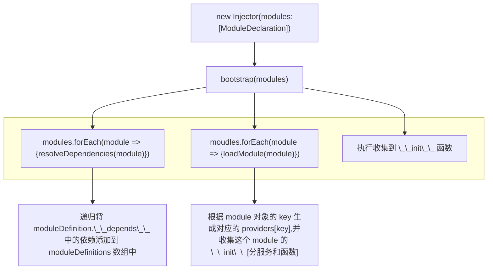
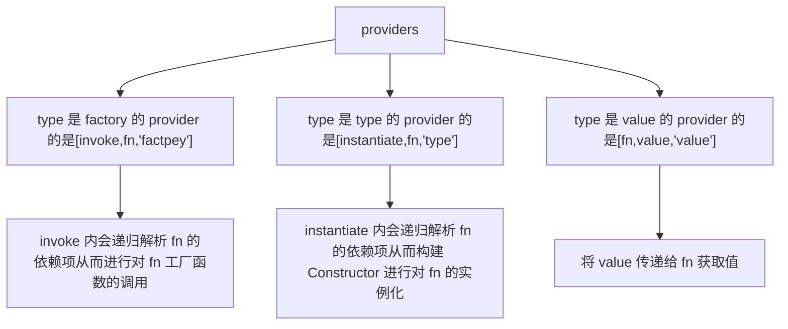

# didi 依赖注入流程

## 启动流程

## get 流程

通过 invoke 和 instantiate 调用 provider 中注册的 fn -> 递归解析和获取 fn 的依赖项
支持的依赖解析和注入的方式在 **fnDef** 函数中
providers[key]  索引 1 的元素是进行 fnDef 的位置 -> 也即 module 配置中 key 对应的数组的索引为 1 的位置[ type or factory 的值]

- 数组方式：[dep1,dep2,...,fn]
- 函数的 $inject 属性方式
- 函数的参数名自动解析、参数名注释自动解析、构造函数参数名自动解析
